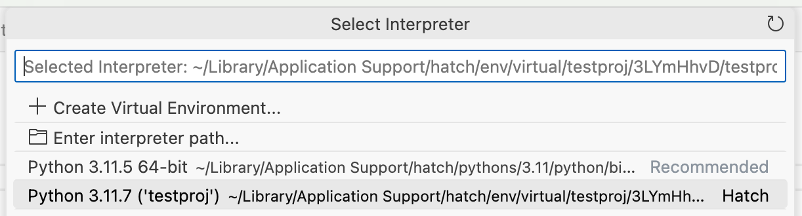
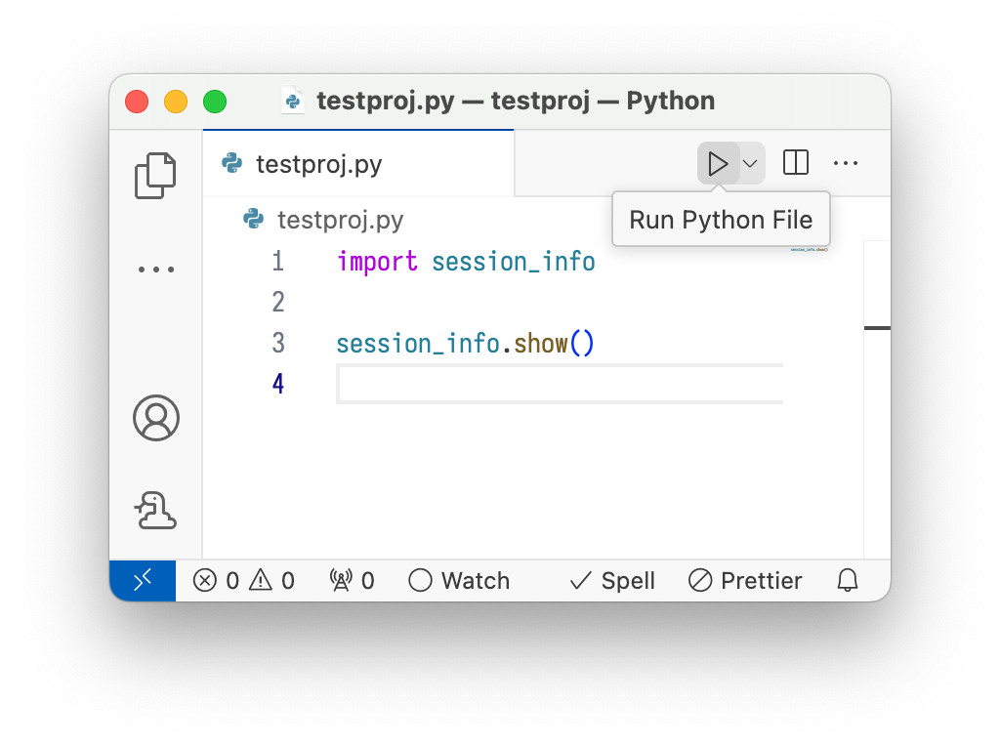

# 如何在 Visual Studio Code 中使用 Hatch 环境

-----

Visual Studio Code 在 `vscode-python` 的 [2024.4 版本](https://github.com/microsoft/vscode-python/releases/tag/v2024.4.0) 中宣布支持 [Hatch 环境发现](https://code.visualstudio.com/updates/v1_88#_hatch-environment-discovery)。

为使该功能正常工作，您应[全局安装 Hatch](../../install.md)。如果您在 Windows 或 macOS 上使用图形安装程序，或通过例如 Arch Linux 或 Fedora 的系统软件包管理器安装，通常已经设置好了。

??? note "设置 PATH"

    如果您使用 [pipx](../../install.md#pipx) 安装 Hatch，而不是系统范围安装，则可能需要将 `$HOME/.local/bin` 添加到 *图形会话* 的 PATH 环境变量中，而不仅仅是终端中的 PATH。可使用如下方式检查：

    ```console
    $ pgrep bin/code  # 或其他图形应用程序
    1234
    $ cat /proc/1234/environ | tr '\0' '\n' | grep -E '^PATH='
    PATH=/usr/local/sbin:/usr/local/bin:/usr/sbin:/usr/bin:/sbin:/bin
    ```

    如果路径中没有包含该目录，您需要根据所用桌面环境，在会话启动脚本中添加该路径：

    - [KDE Plasma](https://userbase.kde.org/Session_Environment_Variables)
    - [GNOME](https://help.ubuntu.com/community/EnvironmentVariables#Session-wide_environment_variables)

## 项目配置

1. 使用 [`env create`](../../cli/reference.md#hatch-env-create) 命令让 Hatch 安装项目及其依赖到一个环境中。

2. 使用 ++“Python: Select Interpreter”++ 命令选择解释器：

     <figure markdown>
         { loading=lazy role="img" }
     </figure>

3. 此时应该可以使用该环境。例如，如果您已将 `python.terminal.activateEnvironment` 设置为 `true`，当您打开新的终端时，环境应会自动激活。或者，您也可以点击“运行”按钮在该环境中运行文件：

     <figure markdown>
         { loading=lazy role="img" }
     </figure>